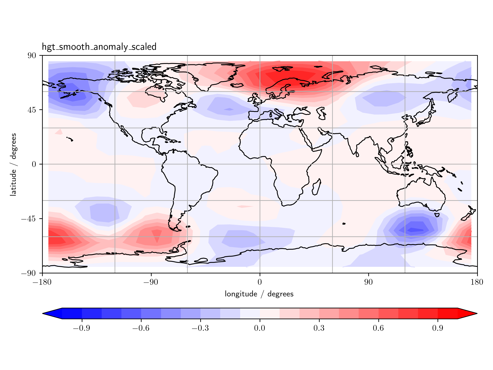
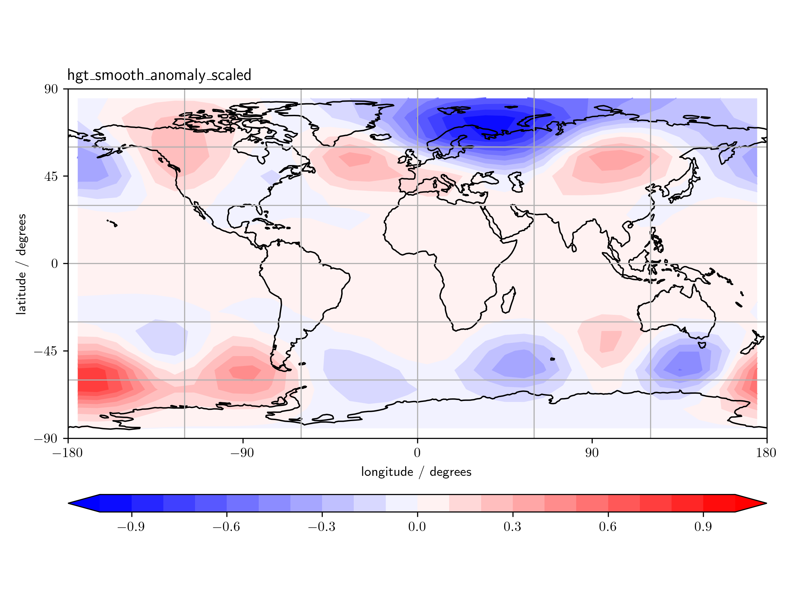

# Fetch and process climate and seasonal data
Angus Gray-Weale
2024-10-10

*This repository is a work in progress. It has been through limited
testing, and requires clearer control of its settings. [Email me if
you’d like access or information about projects and publications that
use this code.](mailto:github.com.h3com@passmail.net)*

It’s helpful if each batch of data need only be downloaded once, or as
few times as possible. It’s also helpful if the same code can download
data from multiple sources, and apply the same processing and analysis
steps.

This repository contains the open source version of `schnauzer`. The
full `schnauzer` code downloads, processes, and analyses NCEP, JRA, and
ERA5 analyses, as well as GEFS or CFS forecasts. The code will then
check the data, regrid as desired, calculate scaled anomalies, and if
appropriate obtain a set of principal components for use in further
analysis.

This public version demonstrates the download of NCEP analysis data at
the surface or on pressure levels, and calculates from these a
covariance matrix and principal components (sometimes called EOFs).

### Multiweek prediction of the state of the northern hemisphere

Imperfect knowledge of the state of the Earth system, combined with
sensitivity to initial state, limits predictions. Useful advanced
warning of extreme weather requires multi-week lead times, as do
decisions on investments sensitive to energy markets. An original
mathematical method, and the design of data structures that describe the
Earth System, reduce the computational complexity and make possible
multi-week predictions not possible with traditional methods, better
even than with supercomputers used by facilities such as [NOAA in the
USA](https://www.ncei.noaa.gov/products/weather-climate-models/global-ensemble-forecast),
the [Met. Office in the UK](https://www.metoffice.gov.uk), and the
[ECMWF in Europe](https://www.ecmwf.int/). This new, lightweight method
outperforms for variables of critical interest the large scale,
computationally expensive, [monolithic models that I developed and
debugged for the Bureau of
Meteorology.](http://www.bom.gov.au/research/projects/ACCESS-S/)

## Who is Toby?

Toby is a schnauzer. He will fetch a stick or a ball if you throw it,
but if you throw it again he will just look at you. He fetched it for
you once! Surely that’s enough? Toby would be good at managing climate
and seasonal data. He likes to do a thing once and do it properly.
