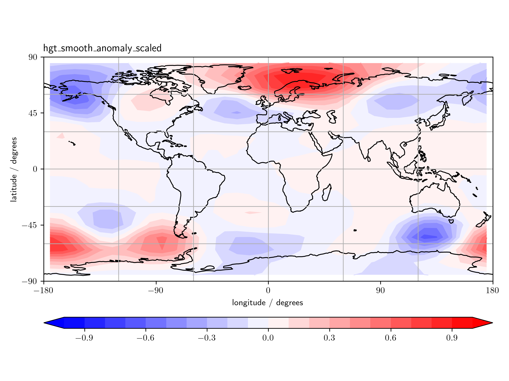
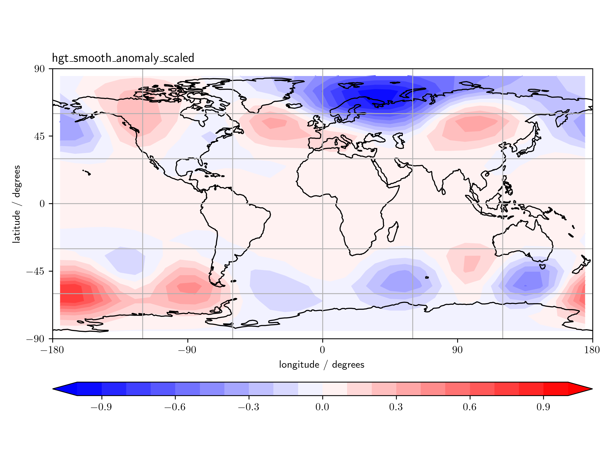

# Fetch and process climate and seasonal data
Angus Gray-Weale
2024-10-04

**Toby is a schnauzer. He will fetch a stick or a ball if you throw it,
but if you throw it again he will just look at you. He fetched it for
you once! Surely that’s enough?**

Toby would be good at managing climate and seasonal data. He likes to do
a thing once and do it properly.

It’s helpful if each batch of data need only be downloaded once, or as
few times as possible. It’s also helpful if the same code can download
data from multiple sources, and apply the same processing and analysis
steps.

This repository contains the open source version of `schnauzer`. The
full `schnauzer` code downloads, processes, and analyses NCEP, JRA, and
ERA5 analyses, as well as GEFS or CFS forecasts. The code will then
check the data, regrid as desired, calculate scaled anomalies, and if
appropriate obtain a set of principal components for use in further
analysis.

This public version demonstrates the download of NCEP analysis data at
the surface or on pressure levels, and calculates from these a
covariance matrix and principal components (sometimes called EOFs).

